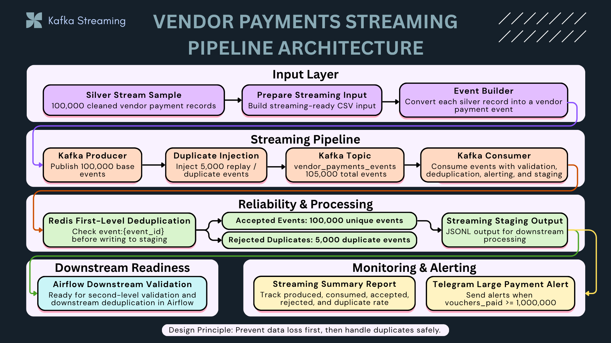
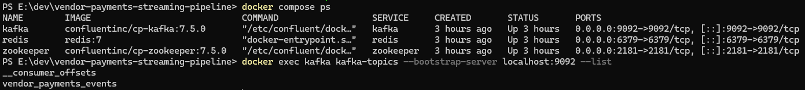
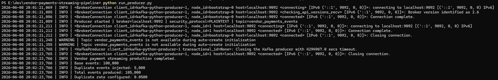
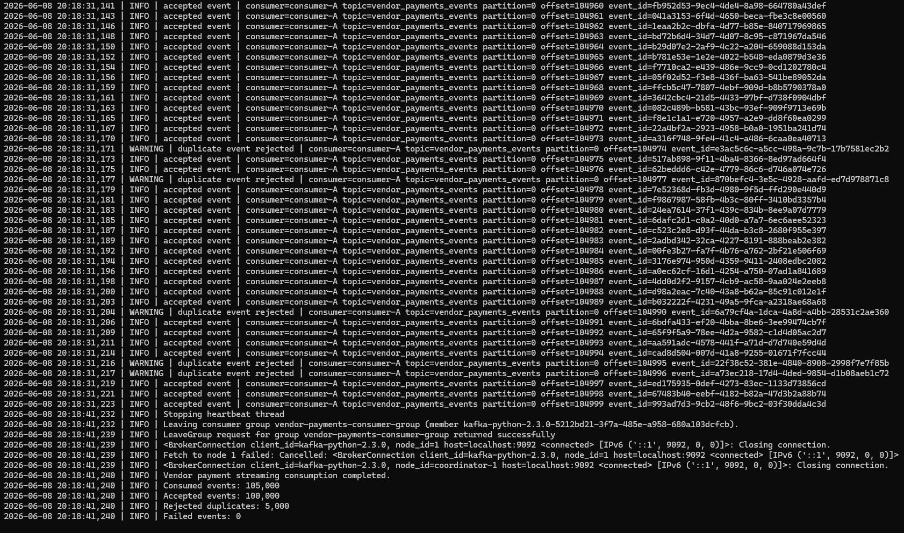
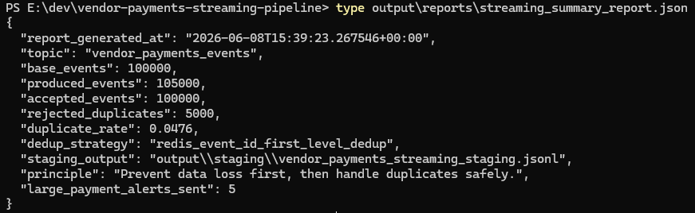
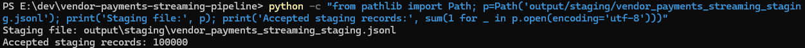
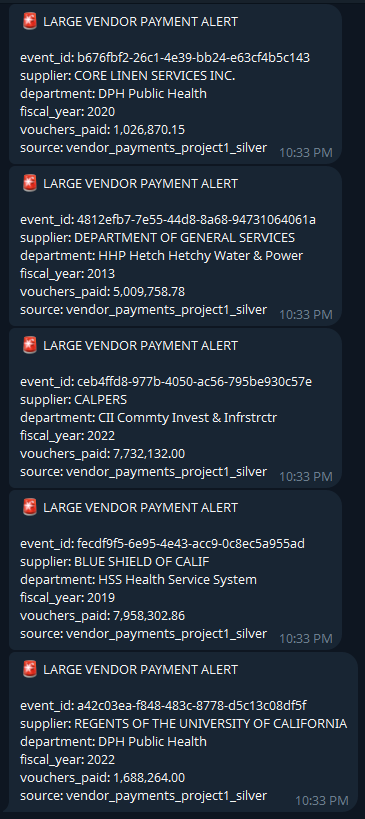
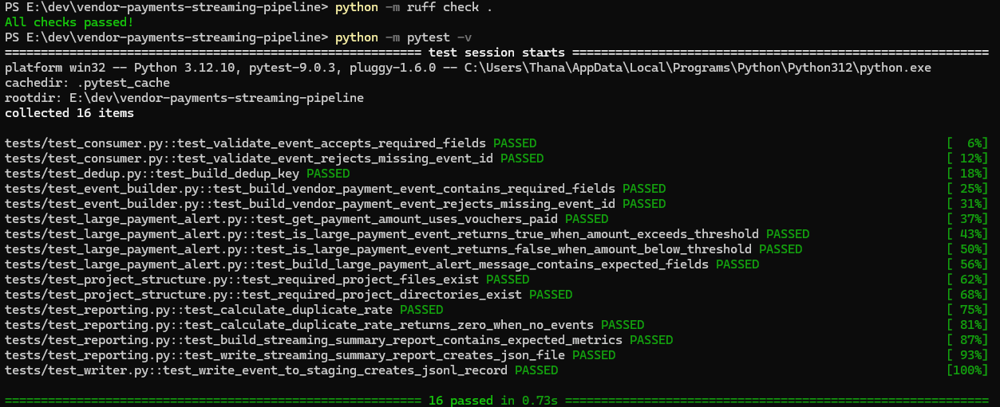

# Vendor Payments Streaming Pipeline


---

## Summary

This project implements a Kafka-based streaming pipeline using real Vendor Payments data.

It simulates a production-style streaming ingestion workflow where cleaned Vendor Payments records are converted into events, published to Kafka, intentionally duplicated to simulate retry/replay scenarios, consumed by a Kafka consumer, deduplicated with Redis, written to a staging layer, summarized in a streaming report, and monitored through Telegram large-payment alerts.

The main design principle is:

```text
Prevent data loss first, then handle duplicates safely.
```

This project is designed as the real-time ingestion layer of a broader Vendor Payments data platform.

---

## Role in the Data Engineering Portfolio

This project is **Project 3** in the Vendor Payments Data Engineering Portfolio.

It connects with the completed batch and cloud track:

```text
Project 1: Vendor Payments Batch ETL Foundation
Project 3: Kafka Streaming Pipeline with Redis Deduplication
Project 4: Airflow Orchestration
Project 5: AWS S3 Data Lake + Athena Analytics
```

Project 3 focuses on streaming ingestion, duplicate-tolerant processing, first-level deduplication, staging output, and operational alerting before downstream Airflow validation.

---

## Architecture



```text
Project 1 Silver Stream Sample
→ Prepare Streaming Input
→ Vendor Payment Event Builder
→ Kafka Producer
→ Duplicate Injection
→ Kafka Topic
→ Kafka Consumer
→ Redis First-Level Deduplication
→ Accepted Events / Rejected Duplicates
→ Streaming Staging Output
→ Summary Report + Telegram Alert
→ Airflow Downstream Validation
```

---

## Final Run Result

The final streaming simulation used **100,000 cleaned silver-level Vendor Payments records** from Project 1.

The producer intentionally injected 5% duplicate/replay events:

```text
Base events: 100,000
Duplicate events injected: 5,000
Total events produced: 105,000
Duplicate rate configured: 0.0500
```

The consumer processed all Kafka events and applied Redis first-level deduplication:

```text
Consumed events: 105,000
Accepted events: 100,000
Rejected duplicates: 5,000
Failed events: 0
```

The staging output contains:

```text
Accepted staging records: 100,000
```

Telegram alerting was also enabled for large vendor payments:

```text
large_payment_alerts_sent: 5
```

---

## Evidence Screenshots

### 1. Kafka, Redis, and Zookeeper Services



This shows the local streaming stack running with Kafka, Redis, and Zookeeper, including the `vendor_payments_events` topic.

---

### 2. Kafka Producer Run



The producer published 100,000 base events and injected 5,000 duplicate/replay events.

---

### 3. Kafka Consumer with Redis Deduplication



The consumer processed 105,000 events, accepted 100,000 unique events, rejected 5,000 duplicates, and recorded 0 failed events.

---

### 4. Streaming Summary Report



The report summarizes produced events, accepted events, rejected duplicates, duplicate rate, dedup strategy, staging output, and alert count.

---

### 5. Staging Output Row Count



The staging JSONL output contains 100,000 accepted records.

---

### 6. Telegram Large Payment Alert



Telegram alerts are triggered when `vouchers_paid >= 1,000,000`.

---

### 7. Tests Passed



The project passes Ruff and pytest validation.

---

## Data Flow

```text
Project 1 silver stream sample
→ data/input/vendor_payments_stream_sample.csv
→ producer builds vendor payment events
→ producer publishes events to Kafka
→ duplicate events are intentionally injected
→ consumer reads from Kafka
→ Redis checks event:{event_id}
→ accepted events are written to staging
→ duplicate events are rejected
→ large payment alerts are sent to Telegram
→ summary report is generated
→ staging output is ready for Airflow downstream validation
```

---

## Design Principle

Distributed streaming systems may deliver events more than once.

This project follows an **at-least-once processing mindset**:

```text
Prevent data loss first, then handle duplicates safely.
```

Kafka is used for reliable event transport, while Redis is used as a fast first-level deduplication store before writing accepted events to staging.

The goal is not to claim exactly-once processing at the ingestion layer. Instead, the pipeline avoids data loss first and then handles duplicates safely through explicit deduplication.

---

## Key Features

* Uses real Vendor Payments data from Project 1
* Streams from cleaned silver-level Vendor Payments records
* Generates a 100,000-row streaming input sample
* Publishes Vendor Payments events to Kafka
* Intentionally injects duplicate events to simulate retry/replay scenarios
* Applies Redis-based first-level deduplication
* Writes accepted events to staging JSONL
* Rejects duplicate events before staging
* Generates a streaming summary report
* Sends Telegram alerts for large vendor payments
* Provides unit tests for event building, deduplication, writer, reporting, alerting, and consumer validation
* Uses Ruff and pytest in GitHub Actions CI

---

## Project Structure

```text
vendor-payments-streaming-pipeline/
│
├── common/
│   ├── alert_notifier.py
│   ├── config.py
│   ├── dedup.py
│   ├── event_builder.py
│   ├── large_payment_alert.py
│   ├── logging_config.py
│   ├── reporting.py
│   └── writer.py
│
├── producer/
│   └── producer.py
│
├── consumer/
│   └── consumer.py
│
├── scripts/
│   ├── create_topic.ps1
│   └── prepare_stream_sample.py
│
├── assets/
│   └── vendor-payments-streaming/
│
├── data/
│   └── input/
│
├── output/
│   ├── staging/
│   └── reports/
│
├── tests/
│
├── docker-compose.yml
├── run_producer.py
├── run_consumer.py
├── requirements.txt
└── README.md
```

---

## Main Components

### 1. Streaming Sample Preparation

```text
scripts/prepare_stream_sample.py
```

This script reads the silver stream sample from Project 1 and prepares a streaming input file for Project 3.

Input source:

```text
E:\dev\vendor-payments-etl-analytics\data\processed\silver\vendor_payments_silver_stream_sample_100k.csv
```

Generated streaming input:

```text
data/input/vendor_payments_stream_sample.csv
```

The sample contains 100,000 cleaned Vendor Payments records.

---

### 2. Event Builder

```text
common/event_builder.py
```

The event builder converts each Vendor Payments row into a structured Kafka event.

Each event contains:

```text
event_id
event_type
event_timestamp
source_system
source_row_hash
business_composite_key
fiscal_year
supplier_name
department
vouchers_paid
payment_amount
payload
```

The full row is preserved inside the payload so downstream systems can still access the original event data.

---

### 3. Kafka Producer

```text
producer/producer.py
```

The producer reads the prepared streaming sample, builds Vendor Payments events, intentionally injects duplicate events, and publishes all events to Kafka.

Duplicate events reuse the same `event_id` to simulate real retry/replay scenarios.

Kafka topic:

```text
vendor_payments_events
```

Final run:

```text
100,000 base events
+ 5,000 duplicate/replay events
= 105,000 produced events
```

---

### 4. Kafka Consumer

```text
consumer/consumer.py
```

The consumer reads events from Kafka, validates required event fields, applies Redis deduplication, writes accepted events to staging, rejects duplicate events, sends Telegram alerts for large payments, and generates summary metrics.

The consumer uses manual offset commit after processing.

This supports an at-least-once processing design where data loss is avoided first, and duplicates are handled safely by Redis.

---

### 5. Redis First-Level Deduplication

```text
common/dedup.py
```

Redis is used as a first-level deduplication store.

Deduplication key format:

```text
event:{event_id}
```

If the event ID already exists in Redis, the event is rejected as a duplicate.

If the event ID does not exist, the event is accepted and marked as processed.

Final result:

```text
Accepted events: 100,000
Rejected duplicates: 5,000
```

---

### 6. Staging Writer

```text
common/writer.py
```

Accepted events are written to:

```text
output/staging/vendor_payments_streaming_staging.jsonl
```

Each accepted event includes:

```text
dedup_status
ingested_at
```

The staging output is designed for downstream validation and secondary deduplication by the Airflow orchestration layer.

---

### 7. Streaming Summary Report

```text
common/reporting.py
```

The streaming summary report is written to:

```text
output/reports/streaming_summary_report.json
```

The report includes:

```text
base_events
produced_events
accepted_events
rejected_duplicates
duplicate_rate
dedup_strategy
staging_output
principle
large_payment_alerts_sent
```

Example report:

```json
{
  "topic": "vendor_payments_events",
  "base_events": 100000,
  "produced_events": 105000,
  "accepted_events": 100000,
  "rejected_duplicates": 5000,
  "duplicate_rate": 0.0476,
  "dedup_strategy": "redis_event_id_first_level_dedup",
  "staging_output": "output\\staging\\vendor_payments_streaming_staging.jsonl",
  "principle": "Prevent data loss first, then handle duplicates safely.",
  "large_payment_alerts_sent": 5
}
```

---

### 8. Telegram Large Payment Alert

```text
common/large_payment_alert.py
common/alert_notifier.py
```

Large payment alerts are triggered when:

```text
vouchers_paid >= 1,000,000
```

Example alert fields:

```text
event_id
supplier
department
fiscal_year
vouchers_paid
source
```

Alerting is controlled by environment variables:

```env
ENABLE_TELEGRAM_ALERTS=false
TELEGRAM_BOT_TOKEN=
TELEGRAM_CHAT_ID=
TELEGRAM_LARGE_PAYMENT_ALERT_LIMIT=5
```

---

## Local Setup

Start Kafka, Zookeeper, and Redis:

```bash
docker compose up -d
```

Check running services and Kafka topics:

```bash
docker compose ps
docker exec kafka kafka-topics --bootstrap-server localhost:9092 --list
```

Prepare the streaming sample from Project 1 silver output:

```bash
python scripts/prepare_stream_sample.py
```

Run the producer:

```bash
python run_producer.py
```

Clear Redis and previous outputs before a clean consumer run:

```bash
docker exec redis redis-cli FLUSHDB
rm -f output/staging/vendor_payments_streaming_staging.jsonl
rm -f output/reports/streaming_summary_report.json
```

On Windows PowerShell:

```powershell
docker exec redis redis-cli FLUSHDB
Remove-Item output\staging\vendor_payments_streaming_staging.jsonl -ErrorAction SilentlyContinue
Remove-Item output\reports\streaming_summary_report.json -ErrorAction SilentlyContinue
```

Run the consumer:

```bash
python run_consumer.py
```

---

## Environment Variables

Example `.env` configuration for local development:

```env
KAFKA_BROKER=localhost:9092
KAFKA_SECURITY_PROTOCOL=PLAINTEXT
KAFKA_SASL_MECHANISM=
KAFKA_USERNAME=
KAFKA_PASSWORD=

TOPIC_VENDOR_PAYMENTS=vendor_payments_events
TOPIC_DUPLICATE_VENDOR_PAYMENTS=vendor_payments_duplicate_events
TOPIC_VENDOR_PAYMENT_ALERTS=vendor_payment_alerts

REDIS_HOST=localhost
REDIS_PORT=6379
DEDUP_TTL_SECONDS=86400

PROJECT1_ROOT=E:\dev\vendor-payments-etl-analytics
PROJECT1_SILVER_SAMPLE_FILE=E:\dev\vendor-payments-etl-analytics\data\processed\silver\vendor_payments_silver_stream_sample_100k.csv

STREAM_SAMPLE_FILE=data\input\vendor_payments_stream_sample.csv
STAGING_FILE=output\staging\vendor_payments_streaming_staging.jsonl
STREAMING_SUMMARY_REPORT_FILE=output\reports\streaming_summary_report.json

STREAM_SAMPLE_SIZE=100000
DUPLICATE_RATE=0.05
RANDOM_SEED=42

LARGE_PAYMENT_THRESHOLD=1000000
TELEGRAM_LARGE_PAYMENT_ALERT_LIMIT=5

LOG_LEVEL=INFO
KAFKA_LOG_LEVEL=WARNING
REDIS_LOG_LEVEL=WARNING

ENABLE_TELEGRAM_ALERTS=false
TELEGRAM_BOT_TOKEN=
TELEGRAM_CHAT_ID=
```

Do not commit real Telegram tokens or chat IDs.

---

## Testing

Run Ruff:

```bash
python -m ruff check .
```

Run tests:

```bash
python -m pytest -v
```

Current test coverage includes:

* project structure validation
* Vendor Payments event builder
* Redis deduplication helper
* staging writer
* streaming summary reporting
* consumer event validation
* large payment alert logic

Current result:

```text
16 passed
```

---

## CI

GitHub Actions validates:

```text
Ruff lint
pytest
Docker Compose config
```

The CI workflow ensures that the streaming project remains testable and maintainable without requiring Kafka, Redis, or Telegram to run inside the unit test suite.

---

## Current Status

Completed:

```text
Vendor Payments config refactor
100,000-row streaming sample preparation
Vendor Payments event builder
Kafka producer with duplicate injection
Redis first-level deduplication helper
Kafka consumer with Redis deduplication
Staging JSONL writer
Streaming summary report
Telegram large payment alerting
Evidence screenshots
Unit tests
Ruff validation
GitHub Actions CI
```

Final run completed successfully:

```text
Produced events: 105,000
Accepted events: 100,000
Rejected duplicates: 5,000
Failed events: 0
Large payment alerts sent: 5
```

---

## What This Project Demonstrates

This project demonstrates practical streaming data engineering patterns:

* Kafka producer and consumer design
* Event-driven ingestion
* At-least-once processing mindset
* Duplicate injection for reliability testing
* Redis first-level deduplication
* Idempotent event processing pattern
* Staging output for downstream batch validation
* Telegram alerting for business-rule monitoring
* Summary metrics for observability
* Unit testing and CI validation
* Integration with a broader batch + orchestration + cloud data platform

This is not only a Kafka demo. It is a streaming ingestion layer designed to integrate with a broader Vendor Payments data platform.
