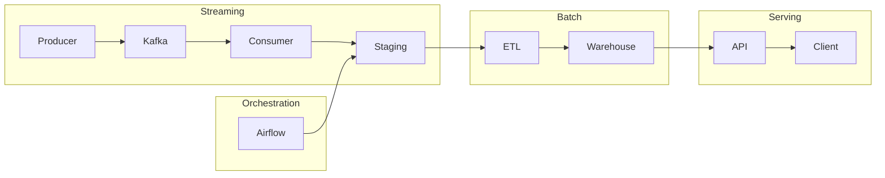

# 🚀 Kafka Streaming Pipeline (Project 3)


A production-style **real-time data pipeline** built with Kafka (Confluent Cloud), Python, and event-driven architecture.  
This project demonstrates ingestion, processing, reliability design, alerting, and integration with downstream systems.

---

# 📸 System Overview


> End-to-end flow: Producer → Kafka → Consumer → Staging → Airflow → Warehouse

---

# 🏗 Architecture Overview



---

# ⚡ Delivery Guarantee & Data Reliability

This system uses **at-least-once delivery**:

- ✅ No data loss
- ⚠️ Duplicate events may occur

Design decision:
- Keep consumer simple and reliable
- Handle deduplication downstream (Airflow)

Trade-off:
- Simpler architecture vs Exactly-once complexity

---

# 📸 Pipeline Walkthrough

## 1️⃣ Kafka Topics


- `sales_events`
- `sales_alerts`
- `duplicate_events`

---

## 2️⃣ Event Flow (Producer → Kafka → Consumer)

Real-time streaming pipeline:

- Producer sends events to Kafka
- Kafka distributes events across partitions
- Consumer processes events in parallel

> Kafka enables scalable, distributed event processing using partition-based parallelism

---

## 3️⃣ Consumer Processing


- Reads events
- Processes data
- Writes to staging
- Triggers alerts

⚠️ At-least-once → duplicates possible

---

## 4️⃣ Staging Output


- JSON structured events
- enriched + metadata
- ready for Airflow ingestion

---

## 5️⃣ Duplicate Event Simulation


- Simulate duplicate events
- Stress test reliability

---

## 6️⃣ Consumer Handling Duplicate


- Consumer allows duplicates
- Ensures no data loss

---

## 7️⃣ Real-time Alerts (Telegram)


Triggered alerts:
- High-value sales
- Risky profit scenarios

---

## 8️⃣ Downstream Deduplication (Airflow)

- Deduplication handled in Airflow
- Final dataset is clean
- Supports at-least-once design

---

# ⚙️ Features

- Real-time streaming (Kafka / Confluent Cloud)
- At-least-once delivery (no data loss)
- Downstream deduplication strategy
- Event-driven alerting (Telegram)
- Scalable consumer group architecture
- Integrated with Airflow orchestration

---

# 🧰 Tech Stack

- Kafka (Confluent Cloud)
- Python
- Docker
- Airflow
- Redis
- JSON

---

# ▶️ How to Run

```bash
# Start producer
python run_producer.py

# Start consumer
python run_consumer.py consumer-A

# Test duplicate events
python run_producer_duplicates.py
```

---

# 🧠 Key Concept

Kafka (at-least-once)
→ duplicate possible
→ Airflow dedup
→ clean data

---

# 🧠 Key Learnings

- Streaming pipeline design
- Delivery guarantees (at-least-once)
- Handling duplicates in distributed systems
- Event-driven alerting
- Kafka scaling (partitions & consumers)
- End-to-end data pipeline integration

---


---

# 📊 Monitoring & Observability

## 🔍 Airflow Monitoring


> Airflow DAG execution showing task status, retries, and pipeline health for batch + streaming integration

---

## 📈 Kafka Metrics & System Health


> Kafka topic and partition metrics from Confluent Cloud used to monitor throughput, lag, and system performance

---

## 🧾 Consumer Log Insights


> Consumer log showing high-value detection and alert trigger, including event processing status and anomaly detection


# 📌 Summary

This project demonstrates a **production-style streaming pipeline**:

**Ingestion → Processing → Reliability → Alerting → Orchestration → Serving**

Designed to reflect **real-world data engineering trade-offs and scalability**
