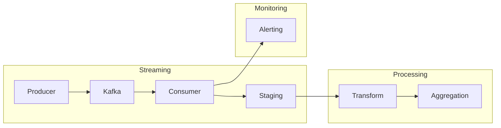

# 🚀 Kafka Streaming Pipeline

---

## 📌 Summary

This project implements a **production-style real-time streaming pipeline** using Kafka.

It focuses on:

- at-least-once delivery (no data loss)
- duplicate handling using Redis
- real-time alert detection
- scalable event processing via partitions
- duplicate handling using Redis (fast, in-memory dedup support)

👉 Designed to simulate real-world streaming systems used in modern data platforms

👉 Prioritizes **reliability over strict correctness**, following real-world distributed system design

---

## 🔗 Integration with Data Platform

This streaming pipeline is part of a larger data platform:

- Events are written to a staging layer (JSONL)
- Airflow (Project 4) consumes staging data for transformation
- Data is aggregated into the gold layer
- Final outputs are served via cloud analytics (Project 5)

👉 This project represents the **real-time ingestion layer** of the platform

---

## 🔄 Data Flow (Simplified)

Producer → Kafka → Consumer → Staging → Airflow → Gold Layer → Analytics

---

## 🏗 Architecture Overview

---

## ⚙️ Design Principles

- At-least-once delivery (prioritize no data loss)
- Lightweight consumer (no heavy state management)
- Partition-based parallel processing
- Event-driven architecture for scalability
- Deduplication handled downstream (Airflow / processing layer)

---

## 🔄 End-to-End Flow

1. Producer generates events  
2. Kafka stores & distributes events  
3. Consumer processes events  
4. Events are written to staging (duplicates may exist)  
5. Alerts triggered for critical events  
6. Airflow handles transformation and deduplication downstream  

---

## 📸 Pipeline Walkthrough

### 1️⃣ Kafka Topics

> Partitioned topics enable scalable streaming ingestion

---

### 2️⃣ Event Flow

> Producer → Kafka → Consumer architecture

---

### 3️⃣ Consumer Processing

> Real-time processing, transformation, and validation

---

### 4️⃣ Staging Output

> Structured JSON output for downstream processing

---

### 5️⃣ Duplicate Simulation

> Testing duplicate scenarios for reliability

---

### 6️⃣ Deduplication

> Duplicate events are detected and skipped

---

### 7️⃣ Real-time Alerts

> Business rules trigger real-time alerts via Telegram

---

## ⚡ Scalability Design

- Kafka partitions enable horizontal scaling of consumers for parallel processing  
- Consumer groups distribute workload across multiple instances  
- The number of consumers is bounded by partitions (consumers ≤ partitions)  
- The architecture allows independent scaling of ingestion and processing layers  

👉 Designed for **high-throughput, distributed event processing**

---

## 🚨 Failure Handling

- Consumers resume processing from committed offsets after failure  
- Kafka ensures **at-least-once delivery**, preventing data loss  
- Trade-off: duplicate events may occur  
- Deduplication is handled downstream (Airflow / processing layer)  

👉 This design prioritizes **data reliability over strict correctness**

---

## 🧠 What This Project Demonstrates

This project demonstrates the design of a **production-style streaming system**:

- Real-time ingestion using Kafka  
- Partition-based parallel processing  
- At-least-once delivery and failure recovery  
- Downstream deduplication strategy  
- Event-driven alerting for anomaly detection  

👉 More importantly, it reflects **system-level thinking beyond individual tools**

---

## 💡 Key Takeaway

This project demonstrates how to design a **production-style streaming system**:

- Reliable ingestion using Kafka (at-least-once delivery)
- Scalable processing via partitioned consumer architecture
- Data correctness ensured through downstream deduplication (Redis + processing layer)
- Real-time observability through alerting and monitoring

👉 Not just a pipeline — but a **resilient, scalable event-driven system design**
