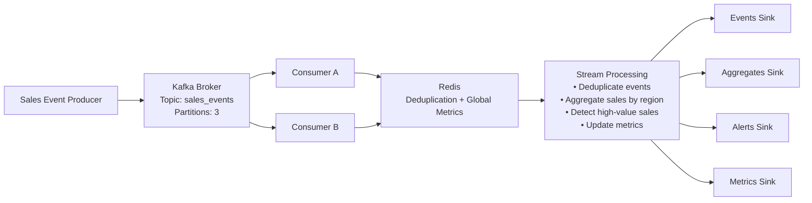
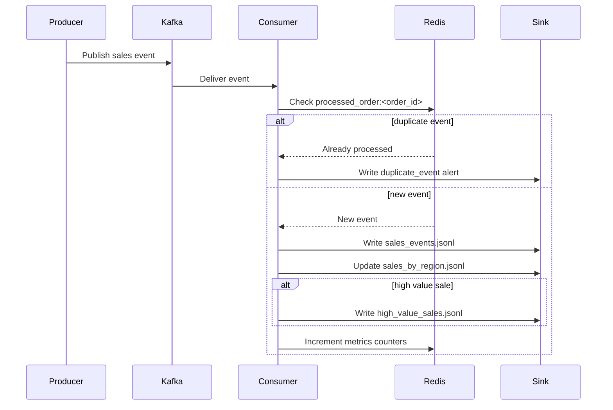

# Kafka Streaming Pipeline


A production-style Kafka streaming pipeline that demonstrates event-driven architecture, consumer-group parallel processing, Redis-based deduplication, and real-time alert detection.

---

# 🧠 Design Goals

This project simulates a **production-style streaming data pipeline** commonly used in modern data platforms.

Key objectives:

- Demonstrate Kafka-based event streaming architecture
- Implement consumer-group parallel processing
- Prevent duplicate event processing using Redis
- Provide structured logging for observability
- Maintain real-time metrics across distributed consumers
- Detect high-value business events through alert rules
- Design a pipeline suitable for containerized deployment

---

# 🚀 Tech Stack

- Python 3.12
- Apache Kafka
- Redis
- Docker & Docker Compose
- Structured Logging
- JSONL streaming sinks
- Git

---

# Key Concepts Demonstrated

This project demonstrates several important streaming system concepts:

- Event-driven architecture
- Idempotent processing
- Consumer group scaling
- Partition-based parallelism
- Distributed state management
- At-least-once processing semantics

  
# 📂 Project Structure

```text
kafka-streaming-pipeline/
│
├── common/
│   ├── config.py
│   └── logging_config.py
│
├── producer/
│   ├── producer.py
│   └── producer_with_duplicates.py
│
├── consumer/
│   └── consumer.py
│
├── scripts/
│   └── create_topic.ps1
│
├── run_producer.py
├── run_producer_duplicates.py
├── run_consumer.py
│
├── docker-compose.yml
├── requirements.txt
└── .gitignore
```

---

# 🏗 Architecture Overview

The pipeline processes streaming sales events using Kafka consumers with Redis-backed deduplication.



---

## ⏱ Event Processing Timeline



# 🔄 Event Flow

# ⚙ Scaling Characteristics

Kafka partitions determine the maximum parallel processing capacity of the pipeline.

Example:

3 partitions → up to 3 active consumers

If the number of consumers exceeds the number of partitions, the additional consumers remain idle.

Example:

3 partitions
6 consumers

Result:

consumer-1 → partition-0  
consumer-2 → partition-1  
consumer-3 → partition-2  
consumer-4 → idle  
consumer-5 → idle  
consumer-6 → idle  

This design ensures ordered event processing within each partition while allowing horizontal scaling through partitioning.

### 1️⃣ Producer

Producers generate sales events and publish them to Kafka.

Example event:

```json
{
  "order_id": 1001,
  "region": "East",
  "sales": 250.0
}
```

---

### 2️⃣ Kafka Topic

Events are written to the topic:

```
sales_events
```

The topic contains **multiple partitions** enabling parallel consumption.

---

### 3️⃣ Consumer Group

Multiple consumers share processing load.

Example:

```
consumer-A
consumer-B
```

Kafka automatically distributes partitions between consumers.

---

### 4️⃣ Redis Layer

Redis provides two important services:

**Deduplication**

```
processed_order:<order_id>
```

Prevents duplicate event processing.

**Global Metrics**

Shared counters across consumers:

```
metrics:events_processed_total
metrics:duplicates_skipped_total
metrics:alerts_triggered_total
```

---

### 5️⃣ Stream Processing

Consumers perform several operations:

- Event deduplication
- Sales aggregation by region
- High-value sales detection
- Metrics tracking
- Structured logging

---

# 📊 Output Sinks

Processed data is written to structured JSONL sinks.

```
output/event/sales_events.jsonl
output/aggregates/sales_by_region.jsonl
alerts/high_value_sales.jsonl
alerts/duplicate_events.jsonl
output/metric/metrics.json
output/metric/global_metrics.json
```

These sinks simulate downstream systems such as:

- Data lake ingestion
- Alerting systems
- Monitoring dashboards

---

# 🐳 Running the Pipeline

Start infrastructure:

```bash
docker compose up -d
```

Create Kafka topic:

```powershell
.\scripts\create_topic.ps1
```

Start consumers:

```bash
python run_consumer.py consumer-A
python run_consumer.py consumer-B
```

Run producer:

```bash
python run_producer.py
```

Run duplicate event simulation:

```bash
python run_producer_duplicates.py
```

---

# 📊 Observability

The pipeline exposes operational insights through:

- Structured logging
- Local consumer metrics
- Redis global metrics

Example metrics:

```
events_processed_total
duplicates_skipped_total
alerts_triggered_total
```

This provides **observability without external monitoring systems**.

---

# ⚠ Alert Detection

The pipeline detects **high-value sales events** based on a configurable threshold.

When triggered:

- An alert event is generated
- Logged with structured metadata
- Written to alert sink

Example:

```
alerts/high_value_sales.jsonl
```

---

# 📐 Key Design Decisions

- Redis-based deduplication prevents duplicate event processing.
- Kafka partitions allow scalable parallel consumers.
- JSONL sinks simulate downstream streaming systems.
- Metrics are shared across consumers using Redis counters.
- Structured logging enables production-style observability.

---

---

## 🎯 Streaming Guarantees

This streaming pipeline implements several reliability guarantees commonly used in real-world event-driven data platforms.

### Delivery Semantics

- At-least-once event delivery
- Consumers commit offsets **only after successful processing**

This ensures events are never lost even if a consumer crashes.

---

### Idempotent Processing

Duplicate events can occur in Kafka systems due to retries or consumer restarts.

To prevent duplicate processing, this pipeline uses **Redis-based deduplication** with the following key pattern:

```
processed_order:<order_id>
```

If an event with the same `order_id` is seen again, it is safely skipped.

---

### Ordering Guarantees

Kafka guarantees **ordering within each partition**.

Events with the same key are routed to the same partition and processed sequentially by the consumer responsible for that partition.

This ensures deterministic event ordering.

---

### Horizontal Scalability

Consumer groups allow parallel processing across multiple partitions.

Example:

```
3 partitions → up to 3 active consumers
```

If more consumers are added than partitions:

```
consumer-1 → partition-0
consumer-2 → partition-1
consumer-3 → partition-2
consumer-4 → idle
consumer-5 → idle
```

Additional consumers remain idle until the number of partitions increases.

---

These guarantees make the pipeline **fault-tolerant, scalable, and production-ready** for real-time event processing systems.

---

# 🔮 Future Improvements

- Real-time notification system (Telegram / Slack)
- Prometheus metrics exporter
- Grafana monitoring dashboards
- Kafka lag monitoring
- Cloud deployment (AWS / GCP)
- CI/CD pipeline

---

# 🏁 Portfolio Context

Part of a **Data Engineering learning portfolio**:

```
ETL Pipeline
      ↓
Analytics API
      ↓
Streaming Pipeline (this project)
      ↓
Cloud Deployment
```

This repository demonstrates **real-time event processing architecture** with Kafka and Redis.
