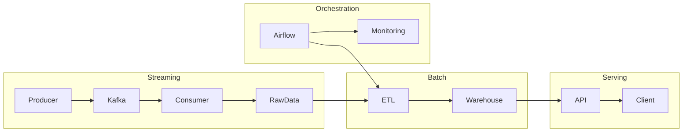

# 🚀 Kafka Streaming Pipeline (Project 3)


> Production-style real-time streaming pipeline with **Kafka, Redis, and Airflow**

---

## 📸 System Overview


---

# 🏗 Architecture Overview



---

# 📸 Pipeline Walkthrough

## 1️⃣ Kafka Topics


---

## 2️⃣ Event Flow


---

## 3️⃣ Consumer Processing


---

## 4️⃣ Staging Output


---

## 5️⃣ Duplicate Simulation


---

## 6️⃣ Deduplication (Consumer)


---

## 7️⃣ Real-time Alerts


---

# ⚙️ Features

- Kafka real-time streaming (Confluent Cloud)
- Consumer group processing
- Redis-based deduplication
- Real-time alert detection
- JSONL staging output
- Airflow batch integration

---

# 🧠 Key Concepts

- Event-driven architecture
- At-least-once processing
- Partition-based scaling
- Idempotent processing
- Streaming + Batch hybrid design

---

# ▶️ Run

```bash
python run_consumer.py consumer-A
python run_producer.py
python run_producer_duplicates.py
```

---

# 📌 Summary

This project demonstrates an **end-to-end streaming pipeline**:

**Ingestion → Processing → Deduplication → Alerting → Batch Integration**

Designed to reflect real-world data engineering systems.
