# 🚀 Kafka Streaming Pipeline

---

## 📌 Summary

This project implements a **production-style real-time streaming pipeline** using Kafka.

It focuses on:

- at-least-once delivery with duplicate-tolerant design
- Redis-based deduplication for idempotent processing
- real-time alerting with warning / critical severity levels
- Kafka partitioning and consumer-group based parallel processing
- pipeline observability through global metrics

👉 Designed to simulate real-world streaming systems used in modern data platforms

👉 Prioritizes **reliability over strict correctness**, following real-world distributed system design

---

## ⚙️ CI Validation

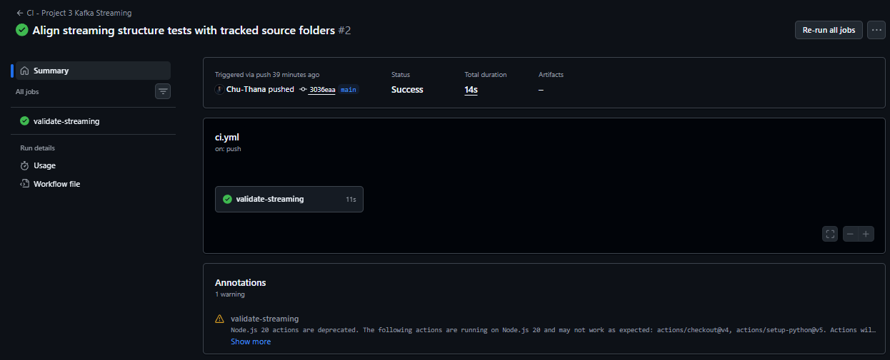

This project includes a GitHub Actions CI workflow that runs automatically on every push to the `main` branch.

The CI pipeline validates:

- Code quality with Ruff
- Project structure for Kafka streaming components
- Required producer, consumer, and common modules
- Docker Compose configuration for the streaming stack

👉 This helps ensure that the Kafka streaming project remains maintainable, structurally consistent, and ready for local container-based execution.

---

## 🔗 Integration with Data Platform

This streaming pipeline is part of a larger data platform:

- Events are written to a staging layer (JSONL)
- Airflow (Project 4) consumes staging data for transformation
- Data is aggregated into the gold layer
- Final outputs are served via cloud analytics (Project 5)

👉 This project represents the **real-time ingestion layer** of the platform

---

## 🔄 Data Flow (Simplified)

Producer → Kafka → Consumer → Staging → Airflow → Gold Layer → Analytics

---

## ⚙️ Architecture Overview

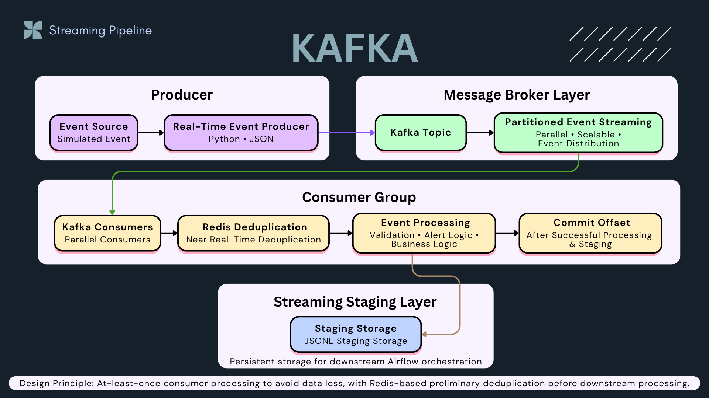

This architecture shows the streaming ingestion layer of the platform, where simulated sales events are produced into Kafka, consumed by a consumer group, deduplicated with Redis, processed with validation and alerting logic, and persisted into a staging layer for downstream Airflow orchestration.

**Design principle:** Prevent data loss first, then handle duplicates safely.

---

## ⚙️ Design Principles

- At-least-once delivery to prevent data loss
- Redis-based deduplication for idempotent event processing
- Partition-based parallel processing with Kafka consumer groups
- Severity-based alerting: warning vs critical
- Staging output for downstream Airflow transformation

---

## 🔄 End-to-End Flow

1. Producer generates events  
2. Kafka stores & distributes events  
3. Consumer processes events  
4. Events are written to staging (duplicates may exist)  
5. Alerts triggered for critical events  
6. Airflow handles transformation and deduplication downstream  

---

## 📸 Pipeline Walkthrough

### 1️⃣ Kafka Topics
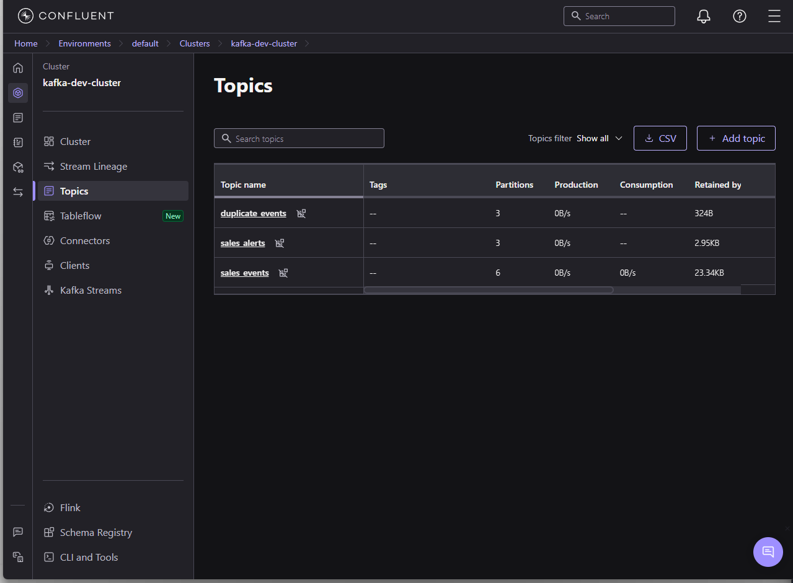

> Partitioned topics enable scalable streaming ingestion

---

### 2️⃣ Event Flow
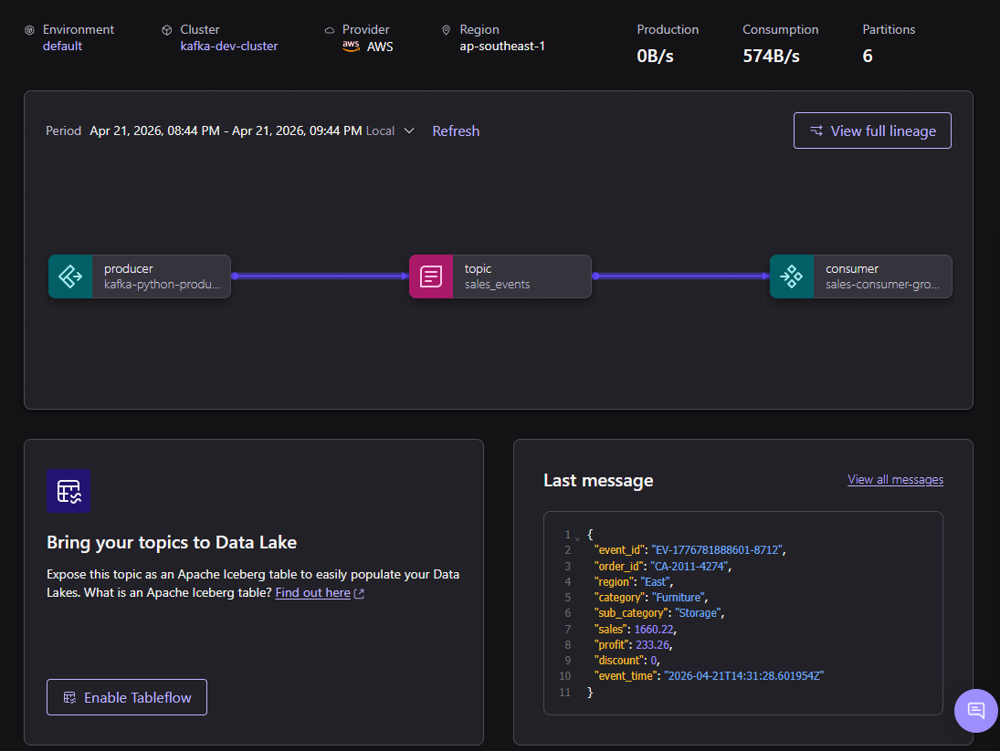

> Producer → Kafka → Consumer architecture

---

### 3️⃣ Consumer Processing
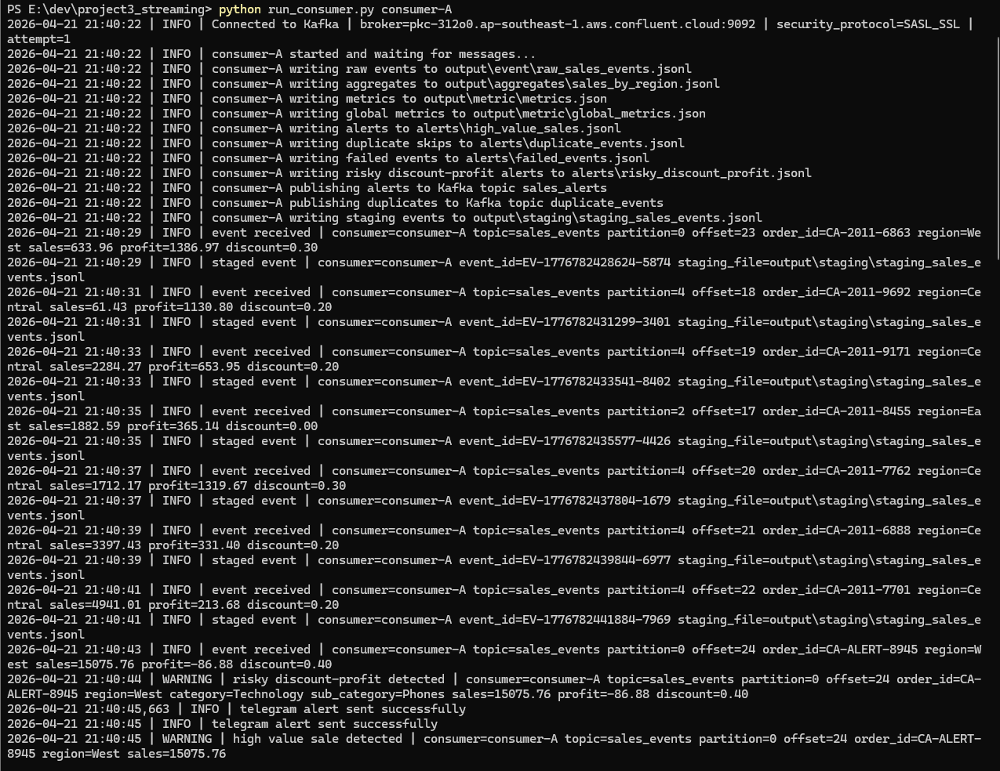

> Real-time processing, transformation, and validation

---

### 4️⃣ Staging Output
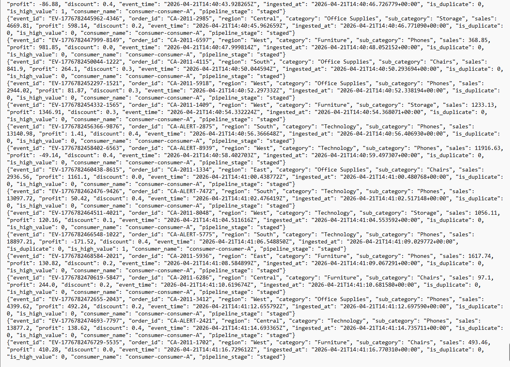

> Structured JSON output for downstream processing

---

### 5️⃣ Duplicate Simulation
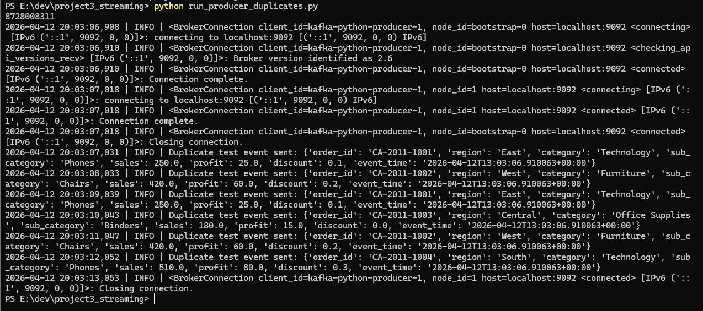

> Testing duplicate scenarios for reliability

---

### 6️⃣ Deduplication
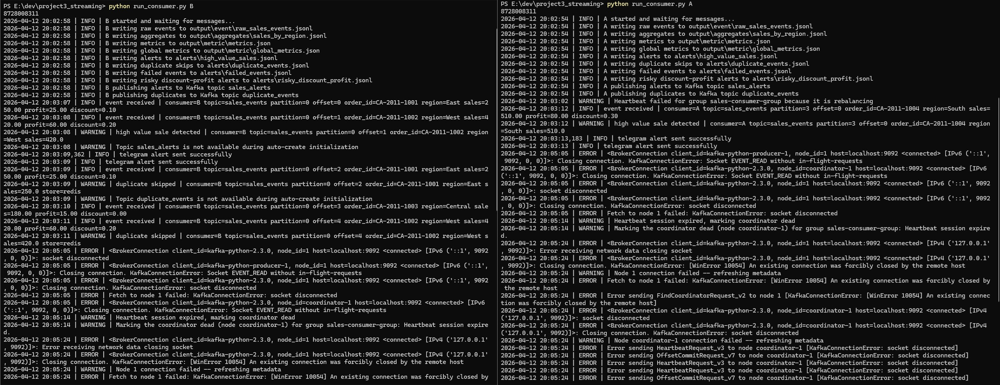

> Duplicate events are detected and skipped

---

### 7️⃣ Real-time Alerts
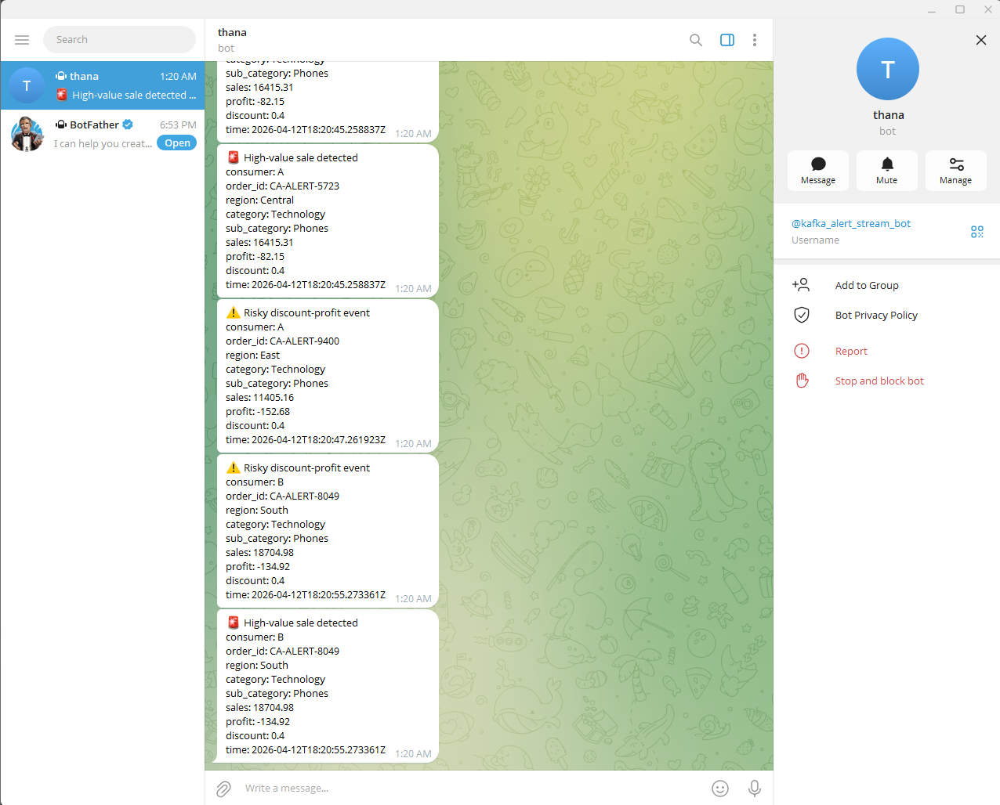

> Business rules trigger real-time alerts via Telegram

---

### 8️⃣ Metrics: Normal Run
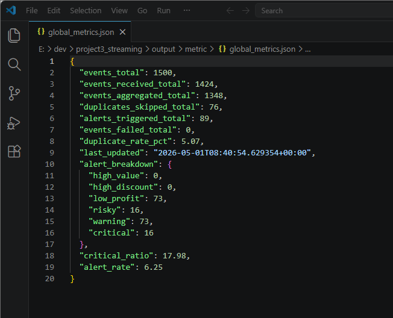

> Normal streaming run with stable alert rate, critical ratio, and zero failed events

---

### 9️⃣ Metrics: Duplicate Stress Test
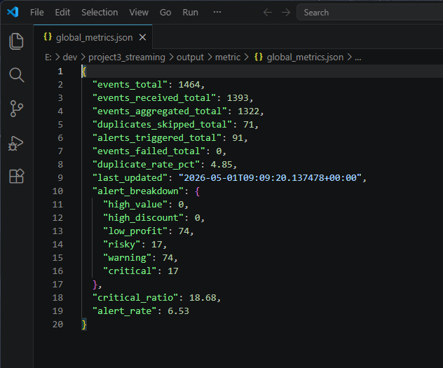

> Duplicate-heavy scenario validating Redis-based deduplication and pipeline stability
> System maintained stable processing with zero data loss under duplicate-heavy conditions.

---

## 📊 Performance Metrics

| Scenario | Events | Duplicate Rate | Alert Rate | Critical Ratio | Failed Events |
|---|---:|---:|---:|---:|---:|
| Normal Run | ~1.4K | ~4.9% | ~6.5% | ~18.7% | 0 |
| Duplicate Stress Test | ~1.5K | ~5.1% | ~6.3% | ~18.0% | 0 |

> Metrics demonstrate stable processing, duplicate handling, and severity-based alert classification under both normal and duplicate-heavy scenarios.

---

## ⚡ Scalability Design

- Kafka partitions enable horizontal scaling of consumers for parallel processing  
- Consumer groups distribute workload across multiple instances  
- The number of consumers is bounded by partitions (consumers ≤ partitions)  
- The architecture allows independent scaling of ingestion and processing layers  

👉 Designed for **high-throughput, distributed event processing**

---

## 🚨 Failure Handling

- Kafka provides at-least-once delivery to avoid data loss
- Redis deduplication prevents duplicate orders from corrupting downstream aggregation
- Invalid events are isolated into failed event logs
- Duplicate-heavy scenarios were tested to validate resilience
- Alert metrics remain stable under stress testing

👉 This design prioritizes **data reliability over strict correctness**

---

## 🧠 What This Project Demonstrates

This project demonstrates the design of a **production-style streaming system**:

- Real-time ingestion using Kafka  
- Partition-based parallel processing  
- At-least-once delivery and failure recovery  
- Downstream deduplication strategy  
- Event-driven alerting for anomaly detection  

👉 More importantly, it reflects **system-level thinking beyond individual tools**

---

## 💡 Key Takeaway

This project demonstrates how to design a **production-style streaming system**:

- Reliable ingestion using Kafka (at-least-once delivery)
- Scalable processing via partitioned consumer architecture
- Data correctness ensured through downstream deduplication (Redis + processing layer)
- Real-time observability through alerting and monitoring

👉 Not just a Kafka demo — this project demonstrates a resilient streaming ingestion layer with deduplication, alert severity, metrics, and stress-tested reliability.
