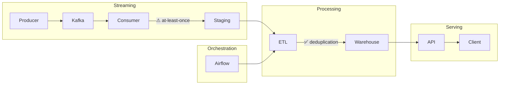

# 🚀 Kafka Streaming Pipeline (Project 3)


A production-style **real-time data pipeline** built with Kafka (Confluent Cloud), Python, and event-driven architecture.  
This project demonstrates ingestion, processing, reliability design, alerting, and integration with downstream systems.

---

# 📸 System Overview


> End-to-end flow: Producer → Kafka → Consumer → Staging → Airflow → Warehouse

---

# 🏗 Architecture Overview


> The system uses at-least-once delivery in Kafka, which may introduce duplicate events.
> These duplicates are resolved in the downstream ETL layer orchestrated by Airflow.

---

# ⚡ Delivery Guarantee & Data Reliability

This system uses **at-least-once delivery**:

- ✅ No data loss
- ⚠️ Duplicate events may occur

Design decision:
- Keep consumer simple and reliable
- Handle deduplication downstream (Airflow)

Trade-off:
- Simpler architecture vs Exactly-once complexity

---

## 🔁 Deduplication Strategy (Downstream Processing)

To support at-least-once delivery, duplicate events may occur in this streaming pipeline.

In this project (Kafka layer):
- The consumer intentionally does NOT perform deduplication
- The focus is on reliable ingestion and processing

Deduplication is handled in a downstream pipeline:
- Implemented in Project 4 (Airflow)
- Ensures final data consistency before loading to the warehouse

👉 This design clearly separates reliability (streaming layer) from data correctness (downstream processing)

---

# 📸 Pipeline Walkthrough

## 1️⃣ Kafka Topics


- `sales_events`
- `sales_alerts`
- `duplicate_events`

---

## 2️⃣ Event Flow (Producer → Kafka → Consumer)

Real-time streaming pipeline:

- Producer sends events to Kafka
- Kafka distributes events across partitions
- Consumer processes events in parallel

> Kafka enables scalable, distributed event processing using partition-based parallelism

---

## 3️⃣ Consumer Processing


- Reads events
- Processes data
- Writes to staging
- Triggers alerts

⚠️ At-least-once → duplicates possible

---

## 4️⃣ Staging Output


- JSON structured events
- enriched + metadata
- ready for Airflow ingestion

---

## 5️⃣ Duplicate Event Simulation


- Simulate duplicate events
- Stress test reliability

---

## 6️⃣ Consumer Handling Duplicate


- Consumer allows duplicates
- Ensures no data loss

---

## 7️⃣ Real-time Alerts (Telegram)


Triggered alerts:
- High-value sales
- Risky profit scenarios

---

## 8️⃣ Downstream Deduplication (Airflow)

- Deduplication handled in Airflow
- Final dataset is clean
- Supports at-least-once design

---

# ⚙️ Features

- Real-time streaming (Kafka / Confluent Cloud)
- At-least-once delivery (no data loss)
- Downstream deduplication strategy
- Event-driven alerting (Telegram)
- Scalable consumer group architecture
- Integrated with Airflow orchestration

---

# 🧰 Tech Stack

- Kafka (Confluent Cloud)
- Python
- Docker
- Airflow
- Redis
- JSON

---

# ▶️ How to Run

```bash
# Start producer
python run_producer.py

# Start consumer
python run_consumer.py consumer-A

# Test duplicate events
python run_producer_duplicates.py
```

---

# 🧠 Key Design Insight

This system demonstrates a core streaming principle:

- Streaming systems prioritize availability and reliability
- At-least-once delivery ensures no data loss
- Duplicate handling is shifted to downstream processing

👉 This reflects real-world trade-offs in distributed data systems

---

# 🧠 Key Learnings

- Streaming pipeline design
- Delivery guarantees (at-least-once)
- Handling duplicates in distributed systems
- Event-driven alerting
- Kafka scaling (partitions & consumers)
- End-to-end data pipeline integration

---


---

## 📈 Kafka Metrics & System Health


This view represents real-time event flow and throughput in the Kafka cluster.

These metrics are used to:

- monitor system throughput
- detect consumer lag
- validate real-time processing behavior
- observe real-time system behavior under load

---

## 🧾 Consumer Log Insights


> Consumer log showing high-value detection and alert trigger, demonstrating real-time event processing and anomaly detection

---


# 📌 Summary

This project demonstrates a production-ready streaming system:

- Real-time ingestion with Kafka
- Reliable processing using at-least-once delivery
- Scalable architecture with partitioned consumers
- Data correctness via downstream deduplication
- Monitoring and alerting for observability
- Demonstrates a production-style approach to handling real-time data with reliability and scalability in mind

Designed to reflect **real-world data engineering trade-offs and scalability**
