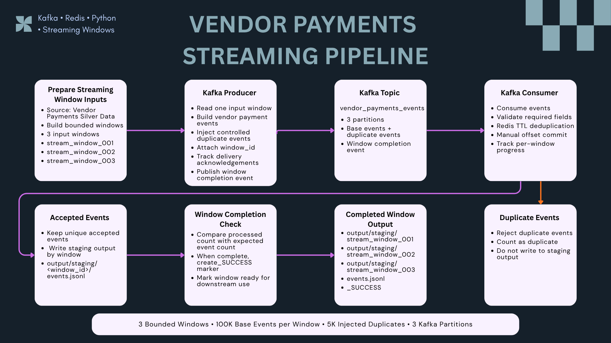
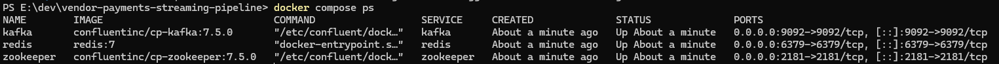
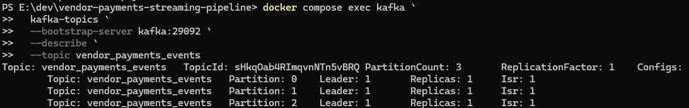
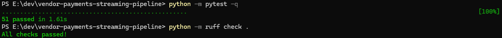
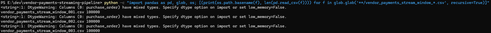
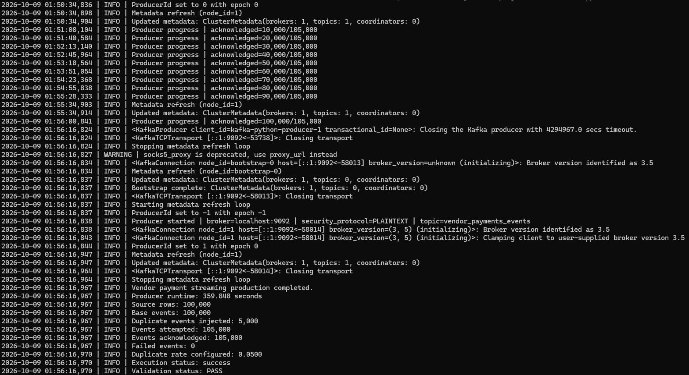
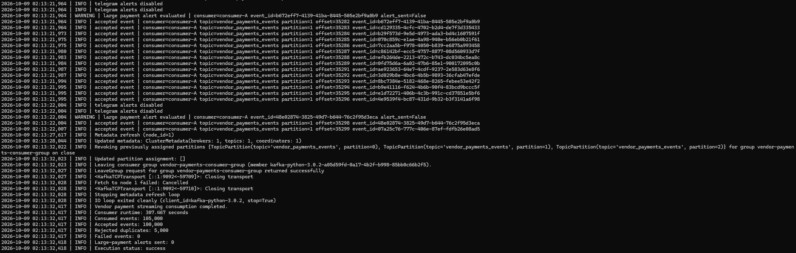
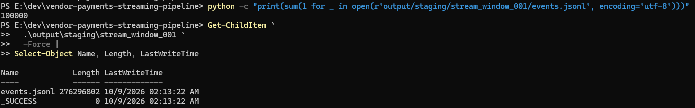
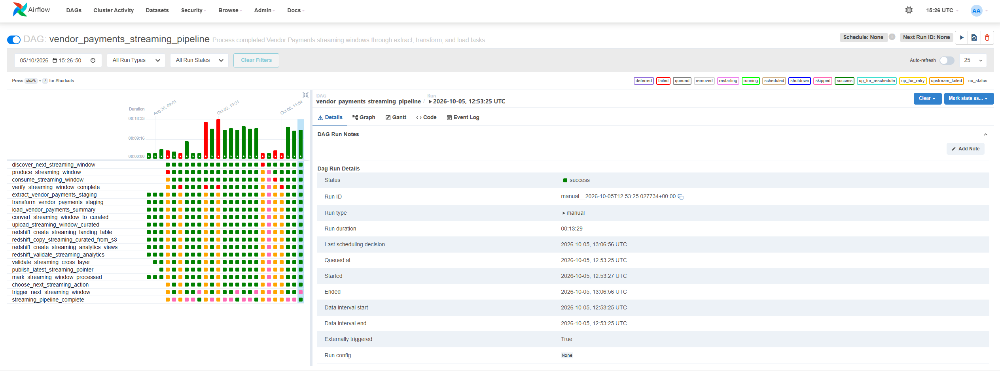
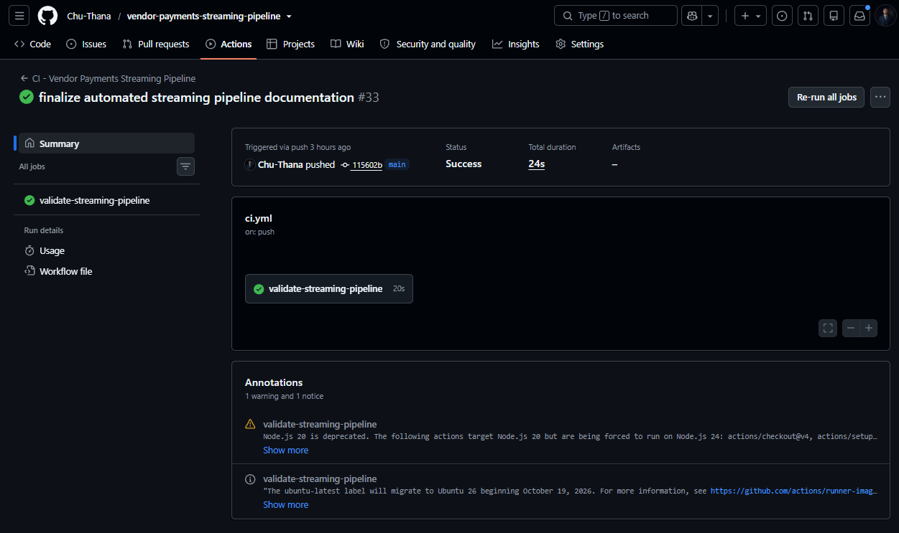

# ⚡ Vendor Payments Kafka Streaming Pipeline


Production-style Kafka streaming ingestion pipeline for converting trusted Vendor Payments Silver records into bounded event windows, injecting controlled duplicates, applying Redis-based deduplication, writing accepted events to per-window staging, and publishing explicit completion markers for downstream orchestration.

This repository is the streaming-ingestion layer of the Vendor Payments Data Platform.

---

## 📌 Project Summary

The pipeline processes three deterministic bounded windows:

```text
stream_window_001
stream_window_002
stream_window_003
```

Each window contains **100,000 source records**.

A clean validation workload uses:

```text
100,000 base events
+ 5,000 injected duplicates
= 105,000 data events
```

The producer also publishes a separate window-completion control event. The consumer rejects duplicate `event_id` values with Redis, writes **100,000 unique accepted events** to per-window staging, and creates `_SUCCESS` when ingestion is complete.

Key capabilities:

- Trusted Silver data as the streaming source
- Three deterministic bounded windows
- Structured Kafka events with `window_id`
- Controlled duplicate injection
- Producer acknowledgement tracking
- 3-partition Kafka topic
- Redis TTL deduplication
- Manual Kafka offset commits
- Per-window JSONL staging
- Explicit `_SUCCESS` markers
- `_PROCESSED` downstream lifecycle marker
- Producer and Consumer runtime metadata
- Event-balance and staging-count validation
- Docker Compose infrastructure
- Separate Kafka host/internal listeners
- Airflow-driven Producer / Consumer execution
- Automated next-window progression
- 51 automated tests
- Ruff linting
- GitHub Actions CI

The main reliability principle is:

```text
Prevent data loss first,
then handle duplicates safely.
```

---

## 🧭 Architecture



```text
Trusted Silver Data
        ↓
Prepare Bounded Windows
        ↓
Kafka Producer
        ↓
vendor_payments_events
        ↓
Kafka Consumer
        ↓
Redis Deduplication
        ↓
Per-Window Staging
        ↓
Window Completion Check
        ↓
_SUCCESS
        ↓
Airflow Downstream Processing
        ↓
_PROCESSED
```

### Layer Responsibilities

- **Streaming Window Preparation** — Builds deterministic 100K-row inputs from trusted Silver data.
- **Kafka Producer** — Reads one window, builds events, injects controlled duplicates, attaches `window_id`, tracks acknowledgements, and publishes a completion control event.
- **Kafka Topic** — Routes `vendor_payments_events` across three partitions.
- **Kafka Consumer** — Validates events, performs Redis deduplication, writes accepted events by window, tracks progress, and commits offsets manually.
- **Window Completion Check** — Verifies the expected accepted-event count before `_SUCCESS`.
- **`_SUCCESS`** — Signals that ingestion for a bounded window is complete.
- **Airflow Downstream Processing** — Processes completed windows through transformation, S3, Redshift, validation, pointer publication, and `_PROCESSED`.
- **`_PROCESSED`** — Signals downstream orchestration for that window is complete.

---

## 📊 Validated Results

| Metric | Result |
| --- | ---: |
| Bounded windows prepared | 3 |
| Source records per window | 100,000 |
| Base events per validation run | 100,000 |
| Duplicate events injected | 5,000 |
| Data events attempted | 105,000 |
| Data events acknowledged | 105,000 |
| Unique events accepted | 100,000 |
| Redis duplicates rejected | 5,000 |
| Producer failed events | 0 |
| Consumer failed events | 0 |
| Staging records produced | 100,000 |
| Kafka partitions | 3 |
| Replication factor | 1 |
| Automated tests | 51 passed |
| Ruff linting | PASS |
| Producer validation | PASS |
| Consumer execution | success |

These metrics are from a local simulated workload for portfolio validation, not production traffic or a production throughput benchmark.

---

## 🖥️ Streaming Infrastructure

Kafka, Redis, and ZooKeeper run locally through Docker Compose.

```powershell
docker compose up -d
docker compose ps
```

Expected services:

```text
kafka
redis
zookeeper
```



### Kafka Listener Design

The final local setup exposes separate host and container listeners:

```text
Windows host / local Python
→ localhost:9092

Airflow / Docker network
→ kafka:29092
```

This lets local Python processes and Docker-based Airflow use the same broker from different network contexts.

---

## 📨 Kafka Topic

```text
Topic: vendor_payments_events
Partition count: 3
Replication factor: 1
```

```text
Partition 0 ─┐
Partition 1 ─┼─> consumer-A
Partition 2 ─┘
```



---

## 🧪 Automated Testing and Code Quality

Run:

```powershell
python -m pytest -q
python -m ruff check .
```

Latest verified result:

```text
51 passed
All checks passed!
```



The tests cover event construction, duplicate injection, acknowledgement metrics, consumer validation, Redis deduplication, per-window staging, `_SUCCESS` creation, event-balance validation, staging-count validation, reset behavior, project structure, and JSONL output.

---

## 🪟 Bounded Streaming Windows

Input preparation creates:

```text
data/input/stream_windows/
├── vendor_payments_stream_window_001.csv
├── vendor_payments_stream_window_002.csv
└── vendor_payments_stream_window_003.csv
```

Each file contains **100,000 source rows**.



The bounded-window lifecycle gives downstream systems explicit, independently trackable work units:

```text
001 → complete → process
002 → complete → process
003 → complete → process
```

---

## 📤 Kafka Producer

Processing flow:

```text
Read one input window
→ Build 100,000 base events
→ Inject 5,000 controlled duplicates
→ Attach window_id
→ Publish 105,000 data events
→ Track delivery acknowledgements
→ Publish window-completion control event
→ Generate execution metadata
```

Message-key priority:

```text
business_composite_key
→ source_row_hash
→ event_id
```

Latest clean execution:

```text
Source rows: 100,000
Base events: 100,000
Duplicate events injected: 5,000
Events attempted: 105,000
Events acknowledged: 105,000
Failed events: 0
Execution status: success
Validation status: PASS
```



The producer is directly executable from the command line and can also be invoked by Airflow as part of the automated window lifecycle.

---

## 📥 Kafka Consumer

Processing flow:

```text
Poll Kafka
→ Validate required fields
→ Read window_id
→ Check event_id in Redis
→ Reject duplicate or accept event
→ Write accepted event to per-window staging
→ Track progress
→ Commit Kafka offset
→ Evaluate completion
→ Create _SUCCESS
```

Automatic offset commits are disabled:

```python
enable_auto_commit = False
```

Latest clean execution:

```text
Consumed data events: 105,000
Accepted events: 100,000
Rejected duplicates: 5,000
Failed events: 0
Execution status: success
```



---

## ♻️ Redis Deduplication Strategy

Redis is the first-level deduplication boundary.

```text
event:{event_id}
```

```text
event_id not found
→ accept
→ append to staging
→ set Redis key with TTL

event_id already exists
→ reject as duplicate
→ increment duplicate count
→ do not append to staging
```

The project intentionally describes its delivery model as:

```text
At-least-once delivery
→ duplicate-safe application processing
```

It does not claim end-to-end exactly-once semantics.

---

## ✅ Window Completion

A completed ingestion window contains:

```text
output/staging/<window_id>/
├── events.jsonl
└── _SUCCESS
```

Final local validation for `stream_window_001`:

```text
events.jsonl records: 100,000
_SUCCESS: present
```



Lifecycle markers have distinct meanings:

```text
_SUCCESS
= streaming ingestion complete

_PROCESSED
= downstream Airflow processing complete
```

---

## ⚙️ Airflow Window Automation

The final integration removes the remaining manual handoff between bounded windows.

```text
discover next unprocessed window
→ run Kafka Producer
→ run Kafka Consumer
→ verify _SUCCESS
→ extract staging events
→ transform curated data
→ build window summary
→ upload curated output to S3
→ load Redshift
→ create analytics views
→ validate Redshift analytics
→ Athena ↔ Redshift cross-layer validation
→ publish latest.json
→ create _PROCESSED
→ check next window
→ trigger next run or complete
```

This gives the Streaming DAG a retry-safe control loop:

```text
stream_window_001
→ stream_window_002
→ stream_window_003
→ complete
```



Repository responsibility remains separated:

```text
Streaming repository
→ Producer / Consumer implementation
→ Redis deduplication
→ per-window staging
→ _SUCCESS semantics

Airflow repository
→ execution order
→ next-window progression
→ cloud processing
→ _PROCESSED lifecycle
```

---

## 🔎 Downstream Cloud Validation

After `_SUCCESS`, Airflow coordinates downstream Cloud processing.

```text
Completed staging window
→ curated output
→ Amazon S3
→ Redshift landing
→ analytics views
→ Athena ↔ Redshift validation
→ latest.json
→ _PROCESSED
```

Only after downstream processing and validation completes is the window marked `_PROCESSED`.

---

## ⚙️ Continuous Integration

GitHub Actions validates the repository on configured pushes and pull requests.

The current screenshot can remain in place until the final multi-repository push, then be overwritten with the final CI run.



---

## 📸 Final Evidence Set

```text
00_streaming_architecture_v2.png
01_streaming_infrastructure.png
02_streaming_kafka_topic.png
03_streaming_tests_and_lint.png
04_streaming_windows.png
05_producer_execution.png
06_consumer_execution.png
07_window_completion.png
08_streaming_ci_success.png
09_streaming_window_automation.png
```

---

## 🗂️ Project Structure

```text
vendor-payments-streaming-pipeline/
│
├── assets/
│   └── vendor-payments-streaming/
│       ├── 00_streaming_architecture_v2.png
│       ├── 01_streaming_infrastructure.png
│       ├── 02_streaming_kafka_topic.png
│       ├── 03_streaming_tests_and_lint.png
│       ├── 04_streaming_windows.png
│       ├── 05_producer_execution.png
│       ├── 06_consumer_execution.png
│       ├── 07_window_completion.png
│       ├── 08_streaming_ci_success.png
│       └── 09_streaming_window_automation.png
│
├── consumer/
│   └── consumer.py
├── producer/
│   └── producer.py
├── data/
│   └── input/
│       └── stream_windows/
├── output/
│   └── staging/
├── scripts/
├── src/
├── tests/
├── docker-compose.yml
├── .env.example
├── pytest.ini
├── pyproject.toml
├── requirements.txt
└── README.md
```

---

## ▶️ Run Locally

### 1. Start infrastructure

```powershell
docker compose up -d
docker compose ps
```

### 2. Verify Redis

```powershell
docker compose exec redis redis-cli ping
```

Expected:

```text
PONG
```

### 3. Describe Kafka topic

```powershell
docker compose exec kafka `
  kafka-topics `
  --bootstrap-server kafka:29092 `
  --describe `
  --topic vendor_payments_events
```

If the local Kafka volume was intentionally reset, recreate the topic:

```powershell
docker compose exec kafka `
  kafka-topics `
  --bootstrap-server kafka:29092 `
  --create `
  --topic vendor_payments_events `
  --partitions 3 `
  --replication-factor 1
```

### 4. Run Producer

```powershell
python producer/producer.py `
  data/input/stream_windows/vendor_payments_stream_window_001.csv
```

### 5. Run Consumer

```powershell
python consumer/consumer.py
```

### 6. Run tests and Ruff

```powershell
python -m pytest -q
python -m ruff check .
```

---

## 🧹 Clean Local Regression

Kafka offsets, Redis keys, staging files, `_SUCCESS`, and `_PROCESSED` are lifecycle state.

A manual replay should not append a new run onto a completed `events.jsonl` artifact without intentionally resetting the test state first.

```text
previous completed window
≠
new clean replay
```

For evidence or regression testing, prepare the window state explicitly before rerunning Producer / Consumer.

---

## 🔐 Environment Variables

Representative host configuration:

```env
KAFKA_BROKER=localhost:9092
KAFKA_SECURITY_PROTOCOL=PLAINTEXT

TOPIC_VENDOR_PAYMENTS=vendor_payments_events

REDIS_HOST=localhost
REDIS_PORT=6379
DEDUP_TTL_SECONDS=86400

STREAM_SAMPLE_SIZE=100000
DUPLICATE_RATE=0.05
RANDOM_SEED=42

LARGE_PAYMENT_THRESHOLD=1000000

LOG_LEVEL=INFO
KAFKA_LOG_LEVEL=WARNING
REDIS_LOG_LEVEL=WARNING

ENABLE_TELEGRAM_ALERTS=false
```

For Docker-based Airflow execution:

```text
KAFKA_BROKER=kafka:29092
REDIS_HOST=redis
```

Do not commit real credentials, tokens, or secrets.

---

## 🧠 Key Engineering Decisions

### Why bounded windows?

Continuous streaming has no natural completion boundary.

Bounded windows create explicit units that can be produced, consumed, validated, completed, processed downstream, and tracked independently.

### Why `_SUCCESS`?

File existence alone does not prove that ingestion is complete.

`_SUCCESS` is an explicit readiness signal for downstream orchestration.

### Why `_PROCESSED` separately?

```text
_SUCCESS
= Kafka / Consumer ingestion complete

_PROCESSED
= downstream Airflow processing complete
```

### Why inject duplicates?

Retries, replay, restarts, and at-least-once delivery can cause the same logical event to appear more than once.

Controlled duplicate injection makes deduplication measurable and reproducible.

### Why Redis?

Redis provides fast event-ID lookup with TTL support, allowing duplicate events to be rejected before they are appended to accepted-event staging.

### Why manual offset commits?

Manual commits prevent offsets from advancing before application processing is complete and make the at-least-once processing boundary explicit.

### Why not claim exactly-once?

Exactly-once guarantees require coordination across Kafka, processing state, and output systems.

The current design explicitly uses:

```text
At-least-once delivery
→ Redis duplicate detection
→ per-window output validation
→ explicit lifecycle markers
```

### Why three Kafka partitions?

Three partitions demonstrate partitioned routing and prepare the topic for future horizontal consumer scaling.

The current validation uses one consumer process, so the project does not claim a multi-consumer throughput benchmark.

### Why separate Kafka listeners?

The same broker is reached from two network contexts:

```text
Windows host Python
→ localhost:9092

Docker-based Airflow
→ kafka:29092
```

Separate advertised listeners keep the broker reachable from both.

### Why automate the next window through Airflow?

The final orchestration preserves each window as an independent retry boundary while removing the manual transition from one window to the next:

```text
discover
→ process
→ mark processed
→ select next
→ trigger next run
```

---

## 🔗 Role in the Vendor Payments Data Platform

```text
Vendor Payments Batch ETL
        ↓
Trusted Silver Data
        ↓
Bounded Streaming Windows
        ↓
Kafka Producer
        ↓
Kafka Topic
        ↓
Kafka Consumer + Redis
        ↓
Per-Window Staging + _SUCCESS
        ↓
Airflow Streaming DAG
        ↓
S3 / Athena / Redshift
        ↓
Cross-Layer Validation
        ↓
latest.json + _PROCESSED
        ↓
API / Analytics
```

---

## 🛣️ Planned Improvements

Possible production-oriented extensions include:

- Dead-letter queue / failed-event replay
- Multi-consumer horizontal scaling with shared completion state
- Consumer lag monitoring
- Centralized observability and alerting
- Schema Registry integration
- Cloud-managed Kafka infrastructure
- Durable shared state strategy for scaled consumers
- Production retention and replay policies

---

## 🎯 Key Takeaway

```text
3 Bounded Windows
→ 100K Base Events / Window
→ 5K Controlled Duplicates
→ Kafka
→ Redis Deduplication
→ 100K Accepted Events
→ _SUCCESS
→ Airflow Automation
→ _PROCESSED
```

The final design provides a reproducible streaming-ingestion layer with explicit processing boundaries, measurable duplicate handling, retry-safe downstream orchestration, and clear ownership across Kafka, Redis, Airflow, and the Cloud analytics layer.
